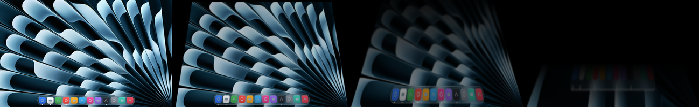
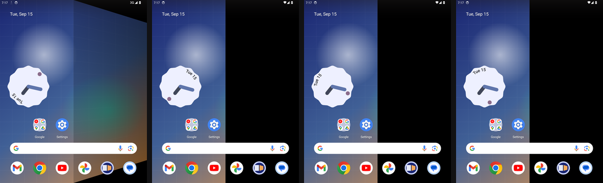

# Hingewave

**The iPhone Duo fold animation for your MacBook lid, Windows laptop and Android foldable.**

Close the lid and the desktop stays anchored in space while the glass tilts over it, blurring and darkening from the hinge outward. Open it and the picture comes back. The physical hinge is the timeline: Hingewave reads the angle sensor every 20 ms and redraws on the GPU, so the motion of your hand is the motion on screen.



One repository, three native apps, one shared definition of the effect. Every port passes the same motion fixtures and the same golden render check in CI.

## Install

### macOS

```sh
curl -fsSL https://raw.githubusercontent.com/Ant-lib/hingewave/main/macos/install.sh | bash
```

That downloads the latest release, verifies its checksum, puts Hingewave in Applications and opens it. A laptop icon appears in the menu bar. macOS then asks for Screen Recording once: turn on Hingewave under System Settings, Privacy and Security, Screen Recording. Now close the lid slowly.

Homebrew users: `brew tap ant-lib/tap` then `brew install --cask ant-lib/tap/hingewave`. Homebrew 6 asks you to trust third-party taps first with `brew trust ant-lib/tap`.

Be aware of what both installers do: because the app is not notarized, the script and the cask remove Gatekeeper's quarantine flag from Hingewave.app after verifying the checksum, so the first launch is not blocked. If you would rather keep Gatekeeper in the loop, use the manual zip route below and approve the app yourself.

Prefer a manual install? Download `Hingewave-mac.zip` from [Releases](https://github.com/Ant-lib/hingewave/releases), unzip, and drag Hingewave.app into Applications. The app is not notarized, so on first open go to System Settings, Privacy and Security, and click Open Anyway.

Requirements: macOS 14 Sonoma or later and a MacBook with a lid angle sensor. That is the 2019 16-inch MacBook Pro and later, MacBook Air with M2 or later, and 14-inch or 16-inch MacBook Pro with M1 Pro or later. The M1 MacBook Air and the 13-inch M1 and M2 MacBook Pro have no continuous sensor; the menu says so and the app stays idle.

### Android

Download `hingewave-<version>.apk` from [Releases](https://github.com/Ant-lib/hingewave/releases) and install it, or add this repository in [Obtainium](https://github.com/ImranR98/Obtainium) to get updates. Open Hingewave, pick a picture or keep the built-in one, and tap **Set as live wallpaper**. Then fold the phone slowly.



It is a live wallpaper, so it needs no accessibility service, no overlay permission and no screen capture. Only the wallpaper folds; icons stay sharp. On the inner screen the moving half folds about the centre line while the other half stays still; on the cover screen the whole panel frosts as the phone opens.

Requirements: Android 13 or later and a foldable whose hinge sensor reports continuous angles to apps. The Galaxy Z Fold 8 and the Pixel Fold family do. The Galaxy Z Fold 7 and earlier, Z Flip 5 and 6, and the Z TriFold expose only 0, 90 and 180 degrees to third-party apps; Hingewave detects that and plays a timed transition instead, and says so in its settings screen.

### Windows

Download `hingewave-x64.exe` (or `hingewave-arm64.exe` for Snapdragon laptops) from [Releases](https://github.com/Ant-lib/hingewave/releases) and run it. A laptop icon appears in the tray. The winget manifest under `windows/winget` is submitted with each release, after which `winget install Ant-lib.Hingewave` works too.

The executable is not code signed, so SmartScreen shows "Windows protected your PC" the first time: click More info, then Run anyway. Verify the download against `SHA256SUMS-windows.txt` if you prefer.

Windows laptops rarely have a hinge angle sensor, so Hingewave picks the best source it can find and shows it in the tray menu:

| Tier | Source | What you get |
|---|---|---|
| 1 | Hinge angle sensor (`Windows.Devices.Sensors.HingeAngleSensor`) | The real thing, continuous |
| 2 | Lid accelerometer, present on most convertibles and 2-in-1s | Continuous angle with the base assumed level; run **Calibrate lid sensor** once from the tray menu |
| 3 | Lid switch only | A fixed 0.6 second transition on close and open |

Requirements: Windows 10 version 2004 or later, a primary display, and Windows Graphics Capture (built in since 2004).

## Using it

### macOS

The menu has four items. **Follow the Lid** turns the effect off and on. **Preview Fold** plays a scripted close and reopen so you can see the effect without touching the lid; before Screen Recording is granted it folds a generated picture instead of your desktop. **Launch at Login** does what it says. **Quit** quits.

Good to know:

- A nudge while typing does not trigger it. The lid has to be closing at a deliberate pace when it crosses 90 degrees.
- Stop part way and the desktop clears back after two seconds, so you can work at any angle.
- Reopen before the Mac sleeps and the effect plays in reverse. Once it has slept, waking ends the effect immediately.
- With an external monitor attached, the effect ends when the built-in display switches off. Nothing lands on the monitor.
- Reduce Motion in System Settings disables the tilt; blur and darkening still follow the lid.

## How it works

| Piece | Role |
|---|---|
| `core/effect.json` | The tuned numbers: eye distance, blur, darkening, spring, angles. One file for every platform. |
| `core/reference/` | Python reference implementation of the motion model and the shader math. Generates the fixtures and golden images every port must pass. |
| `macos/Sources/Hingewave/LidAngleSensor.swift` | Reads the hinge angle over IOKit HID (usage page 0x20, usage 0x8A). Hundredths of a degree on Apple silicon. No permission needed. |
| `macos/Sources/HingewaveCore/LaptopMotionModel.swift` | Critically damped spring plus the idle, armed, active, clearing state machine. Verified against `core/fixtures`. |
| `macos/Sources/Hingewave/ScreenStreamer.swift` | Streams the built-in display through ScreenCaptureKit into Metal textures. Runs only while the lid moves. |
| `macos/Sources/Hingewave/FoldShader.swift` | One Metal fragment pass: perspective hold onto the resting plane, mip-chain blur growing from the hinge, darkening. Verified against `core/golden` by PSNR. |
| `macos/Sources/Hingewave/OverlayWindow.swift` | Click-through window over the built-in display, excluded from every screen capture so it never feeds back into its own picture. |

The full design, including the math, is in [docs/design.md](docs/design.md).

## Privacy

No network access, no analytics, no accounts, on any platform. On macOS and Windows, screen frames go from ScreenCaptureKit or Windows Graphics Capture straight to the GPU and are dropped when the effect clears; screens the system marks secure are not captured. The Android wallpaper captures nothing at all: it only reads the hinge sensor and draws your picture. Event logs (`~/Library/Logs/Hingewave.log` on macOS, `%LOCALAPPDATA%\Hingewave\Hingewave.log` on Windows) never contain screen content.

## Build from source

### macOS

The Xcode Command Line Tools are enough (`xcode-select --install`). The Metal shader compiles at runtime, so full Xcode is not required.

```sh
git clone https://github.com/Ant-lib/hingewave.git
cd hingewave/macos
./build.sh --install --run
```

`./build.sh --universal --zip` produces the release zip with an Intel slice. `swift test` runs the motion model against the shared fixtures. Debug flags on the built binary:

```
Hingewave --probe 5              print the lid angle for five seconds
Hingewave --render-check /tmp/rc render the golden set through Metal and report PSNR
Hingewave --simulate-close       scripted 120 to 0 to 120 sweep over the live desktop
Hingewave --demo                 the same sweep over a generated picture, no permission needed
Hingewave --preview 45           move to one angle and hold until the effect clears
```

### Android

JDK 17 and the Android SDK (platform 35). `cd android && ./gradlew :app:testDebugUnitTest :app:assembleDebug`. With a device or emulator attached, `./render-check.sh` runs the golden check through the real GPU pipeline and `./emulator-check.sh` additionally applies the wallpaper and drives the virtual hinge, saving screenshots into `android/build/emulator-shots`.

### Windows

The .NET 8 SDK. `dotnet test windows/Hingewave.Core.Tests` runs anywhere, including macOS and Linux; `dotnet build windows/Hingewave.App` compiles anywhere too. `pwsh windows/build.ps1` on Windows publishes the single-file executables, and `hingewave.exe --render-check <dir>` runs the golden check on the WARP software rasteriser. Other flags mirror the macOS ones: `--probe`, `--simulate-close`, `--demo`, `--preview <deg>`.

### Shared core

The reference implementation needs Python 3 with NumPy and Pillow: `pip install -e "core/reference[test]"`, then `python -m pytest core/reference` and, after changing the effect, `python -m hingewave_ref regen` from `core/reference`. CI fails if the committed fixtures and goldens are stale.

## Verified hardware

| Platform | Device | Status |
|---|---|---|
| macOS | 14-inch MacBook Pro, M1 Pro, macOS 26 | Sensor, motion model, Metal renderer and the demo overlay verified on the machine. Live desktop capture still needs a Screen Recording grant on that machine. |
| Android | Emulator, 7.6 inch fold-in profile, API 34, in CI | Unit tests and fixtures pass; the AGSL render check scores 37 to 67 dB against the goldens on the emulator GPU; the wallpaper is applied and driven through a full hinge sweep with screenshots on every CI run. Not yet run on a physical Galaxy Z Fold 8. |
| Windows | GitHub Actions runner, WARP software rasteriser | Unit tests, fixtures and the golden render check pass in CI. Not yet run on a physical laptop; a Lenovo Yoga 7i 2-in-1 is the planned test machine. |

Physical Galaxy Z Fold 8 and Windows laptop reports are welcome as issues. Include the device, OS version, what the settings screen or tray menu says about the sensor, and a short recording if you can.

## Credits

The lid angle sensor was documented by [Sam Henri Gold's LidAngleSensor](https://github.com/samhenrigold/LidAngleSensor) (Apache 2.0). [Lidfold](https://github.com/colehollander10-netizen/lidfold) and [Mac Duo](https://github.com/DhananjayBhosale/MacDuo) showed the way on macOS; [duo-open](https://github.com/marcoazeem/duo-open) and [FoldFX](https://github.com/iamkeeler/FoldFX) on Android. Hingewave is independent work and is not affiliated with Apple, Samsung, Google or Microsoft. iPhone, iPhone Duo and MacBook are trademarks of Apple Inc.

## License

MIT. See [LICENSE](LICENSE).
